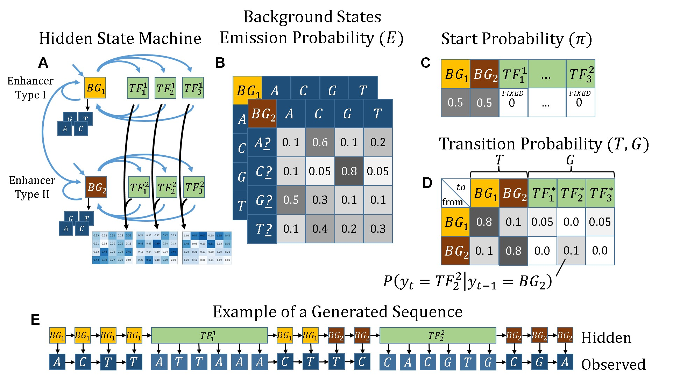
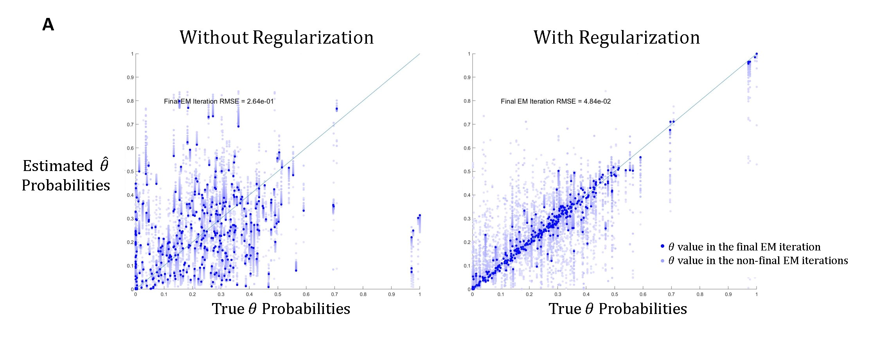
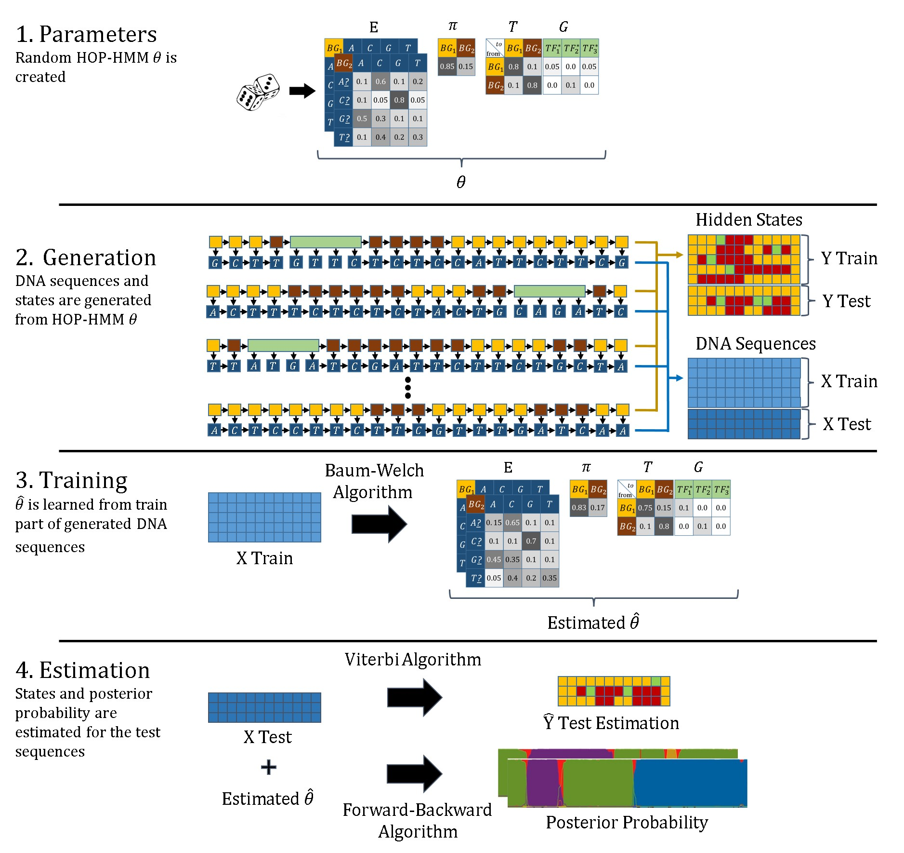

# HOP-HMM
Structured HMM implementation, which has k-order emission model and also states with PWM based emission (PWMs taken from JASPAR).  Used for DNA enhancers classificatons, Guided by Prof. Tommy Kaplan.

https://github.com/David-Taub/HOP-HMM/raw/master/Help/theses.pdf

##Figures:

